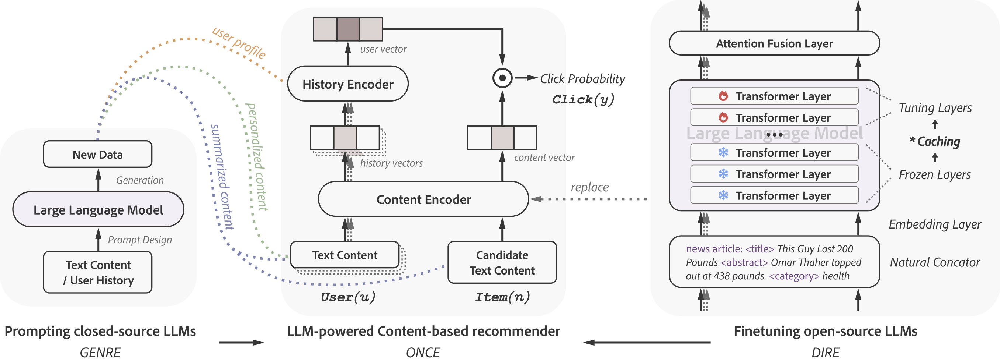

# [Re] ONCE: Boosting Content-based Recommendation with Both Open- and Closed-source Large Language Models



## Abstract

> Recommender Systems have an ever growing need to satisfy the expectations of the users. Noticeable improvements have been achieved on the encoder space, from for example changing the CNN part to a Transformer. However, there still remains a gap in content comprehension within current methodologies. One proposed solution to bridge this gap is [ONCE](https://arxiv.org/abs/2305.06566). This method integrates both discriminative recommendation (DIRE) and generative recommendation techniques (GENRE), which respectively operate on the embedding space and the token space. This work aims to reproduce the experiments of the original paper and validate the authors claim: Large Language Models has potential to enhance the performance of content-based recommendation systems. 

## Original work Citation

```bibtex
@inproceedings{liu2023once,
  title={ONCE: Boosting Content-based Recommendation with Both Open- and Closed-source Large Language Models},
  author={Qijiong Liu and Nuo Chen and Tetsuya Sakai and Xiao-Ming Wu},
  booktitle={Proceedings of the Seventeen ACM International Conference on Web Search and Data Mining},
  year={2024}
}
```

## Notes

All the recommendation experiments are conducted under the content based recommendation repository [Legommenders](https://github.com/Jyonn/Legommenders).
It involves a set of news recommenders and click-through rate prediction models.
It is a modular-design framework, supporting the integration with pretrained language models (PLMs) and large language models (LLMs).

## Baselines: NAML and NRMS

To run the [NAML](https://arxiv.org/pdf/1907.05576) and [NRMS](https://aclanthology.org/D19-1671.pdf) baselines on the Eb-NeRD dataset, check out `ebnerd-benchmark\examples\baselines` directory.


## GENRE: Prompting Closed-source LLMs for Content-based Recommendation

### Overview

We employ an additional preprocessing step consisting of first summarizing the bodies of the news articles and then translating all fields. For this, we make use of the following open source LLMs in a generative fashion: [DanSumT5-base](https://huggingface.co/Danish-summarisation/DanSumT5-base) as summarizer and [Helsinki-NLP](https://huggingface.co/Helsinki-NLP/opus-mt-da-en) as translator.

Furthermore, we call GPT-3.5-turbo API provided by OpenAI as closed-source LLM. All the request codes are uploaded in this repository.

### Codes and corresponding generated data

|  Dataset  |            Schemes             |           Request Code           |                            Updated data                            |
|:---------:|:------------------------------:|:--------------------------------:|:--------------------------------------------------------------------:|
|   Eb-NeRD |       Summarization + Translation       |       `ebnerd_summarize_and_translate.py`       |                   `ebnerd-benchmark\data\ebnerd_small\preprocessed.parquet`                   |
|   Eb-NeRD |       Title enhancer           |       `ebnerd_news_title_enhancer.py`       |                `ebnerd-benchmark\data\ebnerd_small\preprocessed_and_title_enhanced.parquet`                    |
|   Eb-NeRD |       User profiler            |       `ebnerd_user_profiler.py`       |                   `ebnerd-benchmark\data\ebnerd_small\train\behaviors_with_user_interests.parquet`                    |
|   Eb-NeRD |       Personalized Content Generator       |       `ebnerd_personalized_news_generator.py`       |                   -                   |

## DIRE: Finetuning Open-source LLMs for Content-based Recommendation

We use LLaMA-7B as open-source LLM.

## Training Pipeline

### Overview

According to the Legommenders framework, we have the following training pipeline:

- **Data Tokenization**: We preprocess the raw data into the format that can be used by the recommenders.
- **Configurations**: We set the configurations, including data selection, lego module selection, weight initialization, and hyperparameters setting. 
- **Training Preparation (optional)**: Before finetuning the open-source LLMs, we will first cache the upper layer hidden states to accelerate the training process.
- **Training and testing**

GENRE and DIRE will be integrated at different stages.

|        Pipeline         | ORIGINAL | GENRE | DIRE |                             Comments                              |
|:-----------------------:|:--------:|:-----:|:----:|:-----------------------------------------------------------------:|
|    Data Tokenization    |    √     |   √   |  ×   |          New data generated by GENRE will be tokenized.           | 
| Config: Data Selection  |    √     |   √   |  ×   |          DIRE can use the same data as the original one.          |
| Config: Lego Selection  |    √     |   ×   |  √   |     GENRE can use the same lego modules as the original one.      |
|  Config: Weight Init.   |    √     |   ×   |  √   | GENRE can use the same weight initialization as the original one. |
| Config: Hyperparameters |    √     |   ×   |  √   |    GENRE can use the same hyperparameters as the original one.    |
|     Training Prep.      |    ×     |   ×   |  √   |      Only DIRE needs to cache the upper layer hidden states.      |
|        Training         |    √     |   √   |  √   |                                                                   |

### Preparation and Data Tokenization

Please refer to `instructions_setup.ipynb` for instructions on how to (1) install the environment, (2) download and convert Llama to transformers-supported version and (3) tokenize the data.

### Configurations

Please refer to `config\data\ebnerd-data.yaml` for the data selection.

Please refer to `config\model\llm\ebnerd-model-naml.yaml` and `config\model\llm\ebnerd-model-nrms.yaml` for the lego module selection.

Please refer to `config\embed\ednerd-embed.yaml` for the weight initialization.

Please refer to `config\exp\ebnerd-exp-prep.yaml` for the training preparation and to `config\exp\ebnerd-exp-train.yaml` for the hyperparameters setting.


Hyperparameters in running `worker.py`:
- `llm_ver`: Large language model version. Related to the path of your downloaded model. For BERT, please set to `12L`, as the selected version is `bert-base-uncased` in `/exp/model/bert-<basemodel>.yaml`. For LLaMA, please set to `7b`. 
- `lora`: Low-rank Adapation. Should be set to `0` during caching.
- `layer`: Frozen layers. Should be set to `0` during caching. Should be set to a cached number of layers during training.
- `embed_hidden_size`: Should be set to the dimension size of LLMs. If not correctly set, there would be a projection layer from the original dimension to the set dimension. Please do not make it happen during content caching.
  - BERT-12L: 768
  - LLaMA-7B: 4092
- `hidden_size`: dimension size that fed into the user encoder. We will not use this feature during caching.
- `fast_eval`: During evaluating or testing the performance of the recommenders, the parameters are not gradient. Thus, for each item and user, we can only calculate their representation once. That would boost the model evaluating and testing. We will not use this feature during caching.
- `lr`: learning rate.
- `item_lr`: learning rate for item encoder if is pretrained language model.

### Training Preparation (for tuning LLaMA)

```bash
python worker.py --embed config/embed/ebnerd-embed.yaml --model config/model/llm/ebnerd-model-naml.yaml --exp config/exp/ebnerd-exp-prep.yaml --data config/data/ebnerd-data.yaml --version small --llm_ver 7b --hidden_size 64 --layer 0 --lora 0 --fast_eval 0 --embed_hidden_size 4096 --batch_size 16 --page_size 16
```

- If using LLaMA-7B, specify `embed` as `config/embed/ednerd-llama.yaml`, `llm_ver` as `7b`, `embed_hidden_size` as`4096`. 
- Ignore `hidden_size` and `fast_eval`.
- You can increase/decrease the batch size and page size values depending on your resources.
- Specify the number of cached layers and storing directory in `config\exp\ebnerd-exp-prep.yaml`. For example, to fine-tune only the last layer, specify layers as [30]; to fine-tune the top 2 layers specify it as [29].
- You can use `config/model/llm/ebnerd-model.yaml` file. The downstream recommender is not used during caching.

### Training and Testing

```bash
python worker.py --embed config/embed/ebnerd-embed.yaml --model config/model/llm/ebnerd-model-naml.yaml --exp config/exp/ebnerd-exp-train.yaml --data config/data/ebnerd-data.yaml --version small --llm_ver 7b --hidden_size 64 --layer 30 --lora 0 --fast_eval 0 --embed_hidden_size 4096 --batch_size 16 --page_size 16
```

- Specify `embed`, `llm_ver`, and `embed_hidden_size` as the instruction above.
- You can increase/decrease the batch size and page size values depending on your resources.
- Specify `layer` as the layer that was cached during preparation and `weights_dir` as the storing directory from the preparation.
